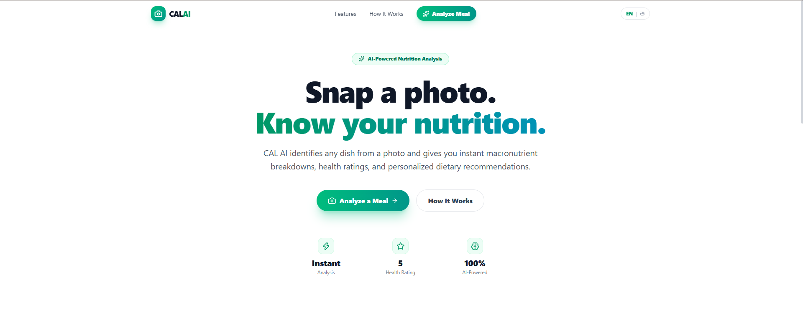
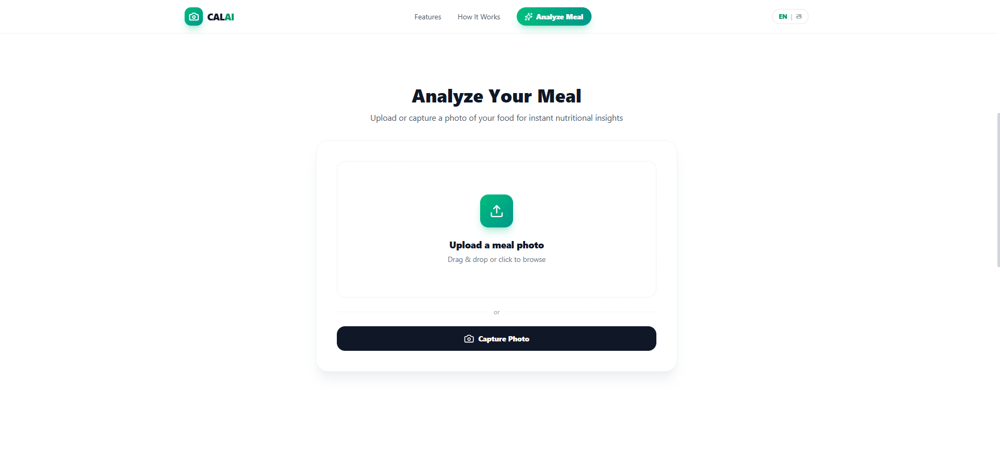
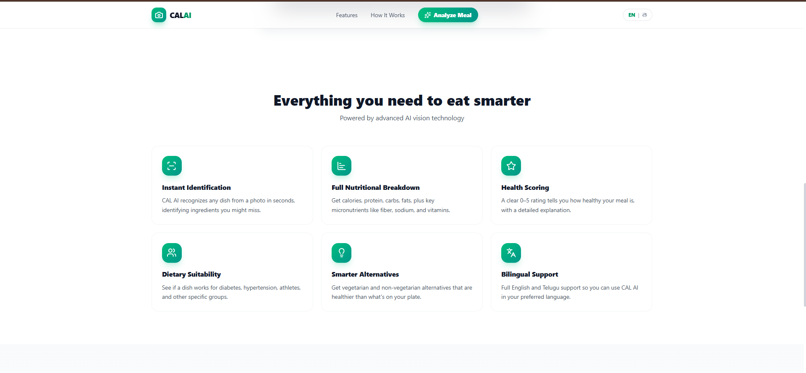
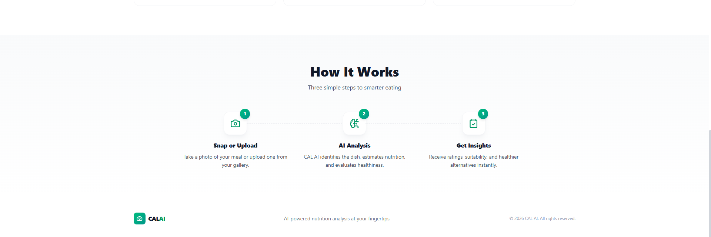
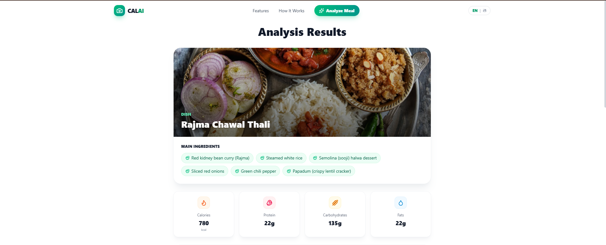
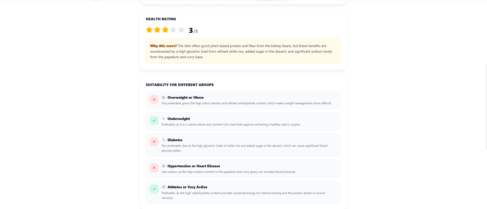
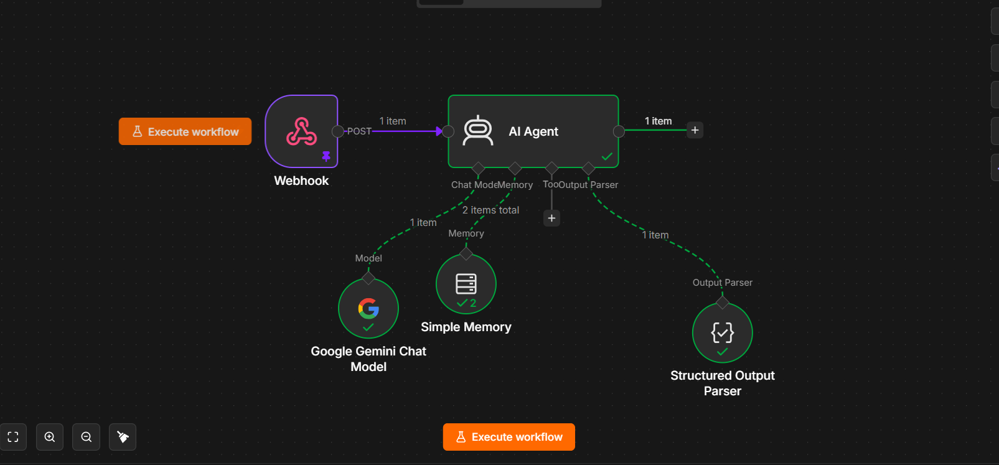

<div align="center">

# 🍽️ CAL AI

### 📸 Snap a Meal. 🤖 Let AI Analyze It. 🥗 Eat Smarter.

An AI-powered nutrition analyzer that identifies food from a single image and instantly provides nutritional insights, health ratings, dietary suitability, and personalized healthier alternatives.

<p align="center">

[](https://react.dev)
[](https://www.typescriptlang.org)
[](https://vitejs.dev)
[](https://tailwindcss.com)
[](https://n8n.io)
[](https://deepmind.google/technologies/gemini/)
[](https://vercel.com)

</p>

### 🌐 Live Demo

## https://cal-ai-tawny.vercel.app/

</div>

---

# 📸 Demo

> *(Replace this with a demo GIF later)*

<p align="center">

</p>

---

# 📖 About

CAL AI is an AI-powered food nutrition analysis web application that allows users to upload or capture an image of their meal and instantly receive a detailed nutritional report.

Instead of manually searching for calories or ingredients, users simply snap a photo and let AI identify the dish, estimate nutrition, evaluate healthiness, and recommend healthier alternatives.

The project integrates **React**, **TypeScript**, **Tailwind CSS**, **n8n**, and **Google Gemini AI** to deliver accurate and user-friendly nutritional insights.

---

# ✨ Features

## 🤖 AI Food Recognition

- Detects meals from images
- Identifies dishes automatically
- Detects visible ingredients

---

## 🥗 Nutrition Analysis

Provides

- Calories
- Protein
- Carbohydrates
- Fat
- Micronutrient estimation

---

## ⭐ Health Rating

AI evaluates the meal and generates

- 0–5 Health Rating
- Detailed explanation
- Nutrition quality assessment

---

## ❤️ Dietary Suitability

Analyzes whether the meal is suitable for

- Diabetes
- Hypertension
- Underweight
- Overweight
- Athletes
- General healthy eating

---

## 🌱 Healthier Alternatives

Suggests healthier

- Vegetarian alternatives
- Non-vegetarian alternatives
- Balanced meal recommendations

---

## 🌍 Multi-language Support

Supports

- English
- Telugu

---

## 📷 Image Upload Options

- Upload Image
- Drag & Drop
- Camera Capture

---

## 📱 Responsive Design

Optimized for

- Desktop
- Tablet
- Mobile

---

# 🖼 Screenshots

## 🏠 Landing Page


Modern responsive landing page with premium UI.

---

## 📷 Upload Meal



Users can upload or capture meal photos instantly.

---

## ✨ Features



The application offers

- Instant Identification
- Nutrition Analysis
- Health Rating
- Dietary Suitability
- Healthier Alternatives
- Telugu Language Support

---

## ⚙️ How It Works



Simple three-step workflow.

---

## 📊 AI Nutrition Analysis



Displays

- Dish Name
- Ingredients
- Calories
- Protein
- Carbohydrates
- Fat

---

## ❤️ Health Analysis



Shows

- Health Score
- AI Explanation
- Dietary Suitability
- Health Recommendations

---

## 🤖 AI Workflow



Backend automation powered using n8n and Google Gemini AI.

---

# 🏗 System Architecture

```text
                   User

                     │

                     ▼

      React + TypeScript Frontend

                     │

          Upload Meal Image

                     │

                     ▼

             n8n Webhook

                     │

                     ▼

        Google Gemini AI Vision

                     │

        Structured Output Parser

                     │

                     ▼

      Nutrition Analysis Response

                     │

                     ▼

      Beautiful React Dashboard
```

---

# ⚙️ How It Works

### Step 1

User uploads or captures a food image.

↓

### Step 2

The image is securely sent to an **n8n Webhook**.

↓

### Step 3

n8n forwards the image to **Google Gemini AI**.

↓

### Step 4

Gemini identifies

- Dish
- Ingredients
- Nutrition
- Health Rating

↓

### Step 5

The AI response is converted into structured JSON.

↓

### Step 6

The frontend displays the nutritional dashboard.

---

# 🚀 Tech Stack

## Frontend

- React 19
- TypeScript
- Vite
- Tailwind CSS v4
- Lucide React

---

## AI & Automation

- Google Gemini AI
- n8n Workflow Automation
- Structured Output Parser

---

## Deployment

- Vercel

---

# 📂 Folder Structure

```bash
CAL-AI
│
├── public/
│
├── screenshots/
│   ├── hero.png
│   ├── analyze-meal.png
│   ├── features.png
│   ├── how-it-works.png
│   ├── results-overview.png
│   ├── health-analysis.png
│   └── workflow.png
│
├── src/
│   ├── components/
│   ├── context/
│   ├── hooks/
│   ├── utils/
│   ├── App.tsx
│   └── main.tsx
│
├── package.json
└── README.md
```

---

# 💻 Installation

Clone the repository

```bash
git clone https://github.com/YOUR_USERNAME/cal-ai.git
```

Go inside

```bash
cd cal-ai
```

Install packages

```bash
npm install
```

Run

```bash
npm run dev
```

Build

```bash
npm run build
```

---

# 🌟 Highlights

✅ AI-powered Food Recognition

✅ Google Gemini Integration

✅ n8n Workflow Automation

✅ Structured AI Responses

✅ Image Upload & Camera Support

✅ Instant Nutrition Analysis

✅ Health Rating System

✅ Dietary Suitability Analysis

✅ Healthier Food Recommendations

✅ English & Telugu Language Support

✅ Responsive Design

✅ React 19

✅ TypeScript

✅ Tailwind CSS

✅ Vite

✅ Vercel Deployment

---

# 🔮 Future Improvements

- User Authentication
- Meal History
- Daily Calorie Tracking
- BMI Calculator
- Personalized Diet Plans
- AI Nutrition Chatbot
- Barcode Scanner
- Weekly Reports
- Meal Dashboard
- PDF Nutrition Reports
- Dark Mode
- Voice Upload
- Multi-image Analysis

---

# 🤝 Contributing

Contributions are always welcome!

If you'd like to improve CAL AI,

1. Fork the repository
2. Create your feature branch

```bash
git checkout -b feature/NewFeature
```

3. Commit your changes

```bash
git commit -m "Added New Feature"
```

4. Push to your branch

```bash
git push origin feature/NewFeature
```

5. Open a Pull Request

---

# ⭐ Support

If you found this project useful,

please consider giving it a ⭐ on GitHub.

It helps others discover the project and motivates future improvements.

---

# 👨‍💻 Author

**Pavan Ch**

- GitHub: https://github.com/chpavan642
- LinkedIn: https://www.linkedin.com/in/pavan-ch-483869190/

---

# 📄 License

This project is licensed under the MIT License.

---

<div align="center">

## 🍽️ CAL AI

### Snap a Meal • Know Your Nutrition • Eat Smarter

Built with ❤️ using React, TypeScript, Tailwind CSS, n8n & Google Gemini AI

</div>
